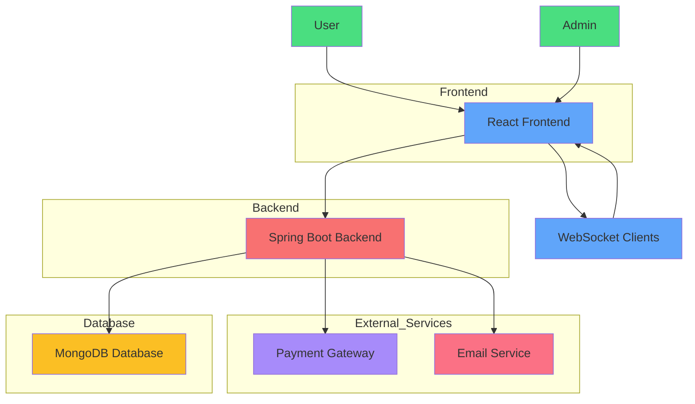

```mermaid
graph TB
    A[User] --> B[React Frontend]
    B --> C[Spring Boot Backend]
    C --> D[MongoDB Database]
    C --> E[Payment Gateway]
    C --> F[Email Service]
    G[Admin] --> B
    H[WebSocket Clients] --> B
    B --> H
    
    subgraph Frontend
        B
    end
    
    subgraph Backend
        C
    end
    
    subgraph External_Services
        E
        F
    end
    
    subgraph Database
        D
    end
    
    style A fill:#4ade80
    style B fill:#60a5fa
    style C fill:#f87171
    style D fill:#fbbf24
    style E fill:#a78bfa
    style F fill:#fb7185
    style G fill:#4ade80
    style H fill:#60a5fa
```